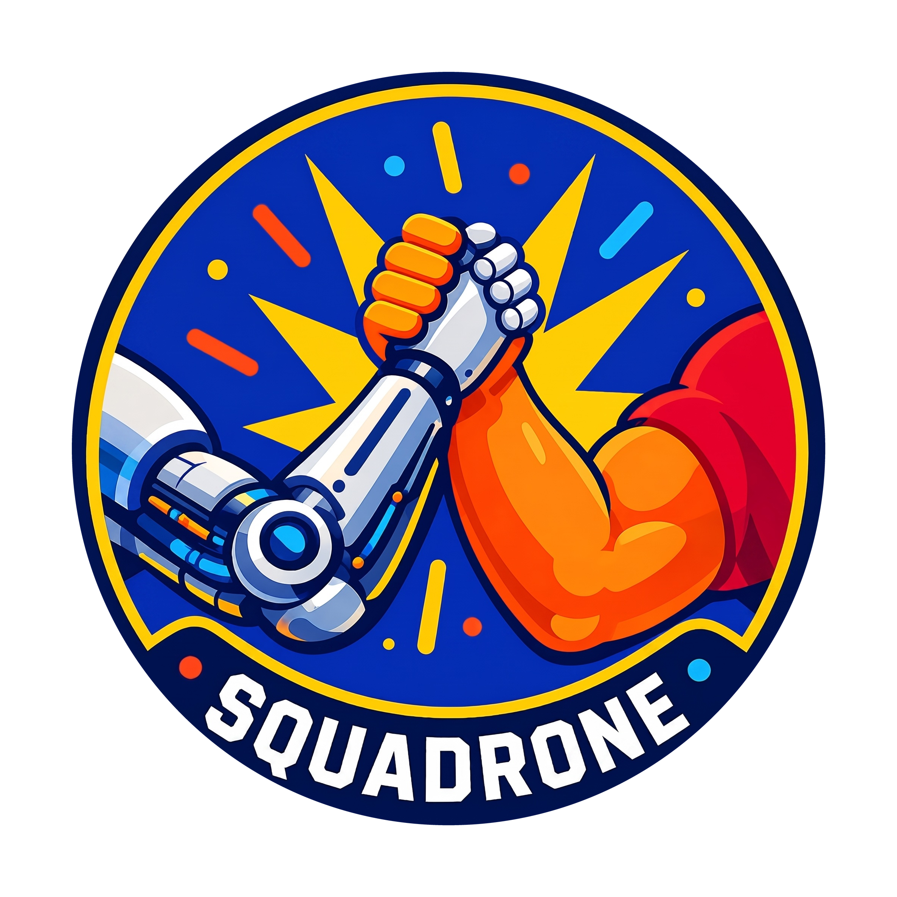

<p align="center">
  
</p>

<h1 align="center">Squadrone</h1>

<p align="center">
  <b>Automated WordPress plugin vulnerability research.</b><br/>
  Deterministic coverage, source review, sandbox verification, and private disclosure drafts.
</p>

Squadrone scans a WordPress.org plugin from source to a reproducible finding. It
combines static inventory with LLM source review, rejects candidates without a
concrete confidentiality, integrity, or availability impact, verifies survivors
in a local Docker WordPress sandbox, checks known vulnerability databases, and
writes private Wordfence or Patchstack report drafts.

It never submits findings automatically.

## Quickstart

Install the prerequisites, make sure Docker and Compose are running, then run:

```sh
git clone https://github.com/pr0f94/Squadrone.git squadrone
cd squadrone
python3.12 -m venv .venv
.venv/bin/python -m pip install "pip==26.2.1"
.venv/bin/python -m pip install -c requirements/constraints.txt -e ".[dev]"
.venv/bin/playwright install chromium
cp .env.example .env
$EDITOR .env
set -a; . ./.env; set +a
.venv/bin/squadrone scan hello-dolly
```

The sole shipped pipeline routes every LLM role to
`chatgpt/gpt-daybreak-blue-latest` through ChatGPT subscription OAuth in
LiteLLM. It uses `medium` reasoning by default. The authenticated ChatGPT
account must be provisioned for that model; no OpenAI API key is needed:

```sh
.venv/bin/squadrone scan hello-dolly --config pipelines/chatgpt.yaml
```

The first `chatgpt/` request may start an OAuth device-code flow. This route does
not need `OPENAI_API_KEY`.

The shipped pipeline has a `$10` estimated ceiling for each plugin run. Before
dispatch, Squadrone blocks a call whose conservative reservation would cross
that ceiling. A response that has already completed is retained and accounted
for. With ChatGPT subscription OAuth, these dollar values are internal
token-price estimates, not API charges or an account invoice.

## Research Process

1. **Intake** downloads the latest release or a pinned historical version,
   rejects closed latest-version targets, and records the source metadata.
2. **Coverage and threat mapping** inventory production PHP, JavaScript,
   TypeScript, templates, built assets, entry points, storage operations, risky
   sinks, roles, capabilities, workflows, and call paths.
3. **Specialist source review** examines four areas by default:
   authorization/workflows, injection/files, XSS lifecycle, and authentication.
   Review is split into resumable source-local batches, and every completed
   review disposition requires cited source. Incomplete work receives up to
   four progressively narrowed attempts; any remaining gap is stored explicitly
   as `unreviewed` rather than silently treated as covered.
4. **Source validation** checks each candidate's citations, reachability,
   controls, attacker role, security boundary, and concrete confidentiality,
   integrity, or availability impact.
5. **Triage** ranks source-valid candidates and selects the configured number
   for sandbox verification. Default scans also apply configured finding-level
   Wordfence and Patchstack class, role, and impact rules. Asset eligibility,
   such as install count, vendor exclusions, and program enrollment, must be
   checked separately. Valid candidates below the cap are retained as deferred.
6. **Sandbox verification** provisions legitimate prerequisites in an isolated
   WordPress/MariaDB stack, executes a generated Python PoC with a structured
   attack/control oracle, restores the database and complete WordPress
   filesystem, and repeats the exact PoC from clean state. Both executions must
   pass before Squadrone creates a finding.
7. **Scoring, deduplication, and reporting** calculate CVSS v3.1 from confirmed
   evidence, query Wordfence Intelligence and, when `WPSCAN_API_KEY` is set,
   WPScan, and create private report drafts for non-duplicate findings that pass
   finding-level routing.

Evidence checks, negative controls, and clean-state confirmation are enforced by
the pipeline. Pipeline YAML configures operational choices such as models,
budget, candidate limits, and sandbox settings.

Verification begins only after Squadrone removes WordPress from its temporary
bootstrap network. At runtime WordPress and MariaDB have only an internal Docker
network, while a trusted fixed-target ingress proxies the sandbox URL from a
host port bound to `127.0.0.1`. Startup inspects the network flags, exact
container memberships, published-port bindings, and Docker's persisted primary
network mode and fails closed if the sealed topology differs. The internal
network remains the persistent restart target while the temporary bootstrap
network owns only the installation-time default route.

HTTP SSRF proofs do not reopen general target egress. When requested, the
ingress receives one unexposed listener for the current parent-owned oracle
port; it denies every path except the fixed `/_squadrone/ssrf/` capability
prefix. Squadrone validates the proxy configuration and probes it from
WordPress. Rotation removes the old relay before releasing its parent port, and
teardown removes the relay before stopping the oracle.

The Docker target keeps this server-side boundary for every PoC. Host-side PoCs
outside the trace-bound HTTP path use a compatibility runner with a filtered
environment, however, and do not yet have strict socket isolation. Browser and
inbound-callback proofs therefore require operator review when external network
access is prohibited.

## Prerequisites

- Python 3.12.14 (recorded in `.python-version`)
- Docker Engine 28.0 or later with Docker Compose 2.33.1 or later (current
  Docker Desktop on macOS); the sealed sandbox uses `priority` and
  `gw_priority` to separate its durable restart network from bootstrap egress
- `ripgrep`
- Playwright Chromium (installed by the Quickstart command)
- `subversion` optional; pinned historical releases use SVN when available and
  fall back to the official versioned ZIP if SVN or the tag is unavailable
- Access to the models selected in the pipeline YAML

On macOS:

```sh
brew install ripgrep subversion
```

Install the project:

```sh
python3.12 -m venv .venv
.venv/bin/python -m pip install "pip==26.2.1"
.venv/bin/python -m pip install -c requirements/constraints.txt -e ".[dev]"
.venv/bin/playwright install chromium
```

`pyproject.toml` pins every direct and development dependency. The constraints
file additionally pins the complete resolved dependency graph; use it for all
supported installs so transitive packages cannot drift independently.

## Configuration

```sh
cp .env.example .env
```

| Variable | Used for | Required |
|---|---|---|
| `ANTHROPIC_API_KEY` | Custom pipeline configurations using Anthropic models | Only for those custom configurations |
| `OPENAI_API_KEY` | OpenAI API models | Not for `chatgpt/` OAuth models |
| `WORDFENCE_API_KEY` | Optional authenticated dedup feed access | No |
| `WPSCAN_API_KEY` | WPScan dedup lookup | No |
| `LITELLM_LOG` | LiteLLM logging level | No |

Pipeline YAML controls model routing, reasoning effort, cost ceiling, candidate
cap, PoC iterations, sandbox images/timeouts, persistent sandbox reuse, failure
state dumps, and optional screenshots. Most users only need to change models or
budget.

`llm.reasoning_effort` is inherited by every agent role. A value under
`reasoning.<role>` overrides it only for that role; the four focused reviewers
all use the `specialists` role. Supported override names are `critic`,
`developer`, `developer_followup`, `surveyor`, `poc_author`, `specialists`,
`reporter`, and `hypothesis_verifier`.

Focused discovery can limit source review to one or more areas; omit this field
to retain all four reviewers in their fixed order:

```yaml
hypothesis_review_areas:
  - injection_files
hypothesis_review_item_types:
  - deserialization
```

Valid areas are `authorization_workflows`, `injection_files`, `xss_lifecycle`,
and `authentication`. The optional item-type list matches deterministic
`CoverageItem.type` values exactly; omit it to review every item type.

## Usage

```sh
# Latest release, default pipeline
.venv/bin/squadrone scan contact-form-7

# Per-run cumulative budget ceiling override
.venv/bin/squadrone scan contact-form-7 --budget 5

# Historical release, primarily for benchmark/regression work
.venv/bin/squadrone scan contact-form-7 --version 5.3.1

# ChatGPT subscription pipeline with detailed logs
.venv/bin/squadrone scan contact-form-7 \
  --config pipelines/chatgpt.yaml --budget 5 --verbose

# Newline-delimited batch, sequential by default
.venv/bin/squadrone scan-batch plugins.txt

# Parallel batch
.venv/bin/squadrone scan-batch plugins.txt --concurrency 3

# Higher-budget research batch ($100 independently per plugin)
.venv/bin/squadrone scan-batch plugins.txt --budget 100 \
  --config pipelines/chatgpt.yaml --verbose

# Resume after the latest completed stage
.venv/bin/squadrone scan contact-form-7 --resume <run_id>

# Resume and force a specific stage onward
.venv/bin/squadrone scan contact-form-7 --resume <run_id> --from verify

# Stop after source-valid triage, before sandbox verification
.venv/bin/squadrone scan contact-form-7 --triage-only

# Verify source-valid candidates without deduplication or reporting
.venv/bin/squadrone scan contact-form-7 --verify-only
```

Use `.venv/bin/squadrone scan --help` or
`.venv/bin/squadrone scan-batch --help` for the complete option reference.
`--triage-only` and `--verify-only` are mutually exclusive:

- `--triage-only` writes artifacts through `triaged.json` and stops before
  Docker verification.
- `--verify-only` includes out-of-program-scope candidates in technical triage,
  runs verification, and skips vulnerability-database lookup and reporting.

A triage-only run can be resumed with either mode. Verify-only resume reuses its
technical-triage artifact; a normal resume reruns triage with disclosure scope
enabled before continuing through verification, deduplication, and reporting.

Resume restores the prior `cost_calls.tsv` before making another model call.
Earlier and resumed calls, including work repeated with `--from`, share one
cumulative ceiling; `--budget` replaces that total ceiling rather than adding
new allowance. A ceiling below already-recorded spend is rejected. Batch
ceilings are independent per plugin.

Ctrl-C retains normal cancellation semantics. Every committed run row is
checkpointed with terminal status `interrupted`, a finish timestamp, cumulative
cost reports, a pipeline ledger entry, and any crash-safe partial findings. In a
parallel batch, cancellation propagates to active peers; queued plugins may not
start, and interrupted runs are resumed individually by run ID.

## Artifacts

Each run is stored under `plugins/<slug>/runs/<run_id>/`. Important files are:

- `intake.json`: target version and source metadata
- `recon.json`: canonical attack-surface and threat map
- `coverage.json`: production files, deterministic review items, and reviewer dispositions
- `hypotheses_<review_area>.jsonl`: each reviewer's candidates
- `coverage_<review_area>.json`: each reviewer's evidence-backed item decisions
- `review_batches/<review_area>/`: bounded reviewer checkpoints used for resume
- `hypotheses.jsonl`: source-verifier survivors
- `triaged.json`: accepted, rejected, merged, deferred, and manual dispositions
- `quality_gate_triage.json`: deterministic source/impact decisions
- `verifications/<hypothesis_id>/`: generated PoCs and optional diagnostics
- `findings.jsonl`: clean-state confirmed findings and structured observations
- `decision_ledger.jsonl`: every keep, reject, defer, verify, dedup, and report decision
- `trace.jsonl`: agent and tool activity
- `cost_calls.tsv`: cumulative per-model-call token and estimated-cost records
- `cost_per_stage.tsv`: cumulative per-stage cost and cache-use summary
- `report_<finding_id>_<program>.md`: private report drafts

Artifacts used for resume are written atomically where possible. Malformed
finding rows are quarantined to `findings_corrupt.jsonl` rather than silently
discarded.

Once a sandbox context is active, teardown removes any active SSRF relay before
releasing its parent listener, attempts `docker compose down -v`, removes the
temporary bootstrap network, and removes temporary work and snapshot
directories after normal completion, failure, and ordinary cancellation.
Cleanup is best effort. An interrupt during optional persistent-sandbox setup,
a repeated interrupt, or a hard process kill may require manual Docker cleanup.
Persistent sandbox reuse remains confined to one verification run.

## Manual Review

Triage or verification may use the manual queue for a source-proven candidate
with one narrow runtime fact automation cannot establish. Quality-gate failures
and lower-ranked candidates are rejected or deferred explicitly.

```sh
.venv/bin/squadrone manual list
.venv/bin/squadrone manual remove <row-or-hypothesis-id>
.venv/bin/squadrone manual clear
```

## Findings And Disclosure

```sh
.venv/bin/squadrone runs list
.venv/bin/squadrone findings show <finding-id>
.venv/bin/squadrone review <run-id>
.venv/bin/squadrone disclose <finding-id> --to wordfence --notes "Submitted privately"
```

Generated reports remain drafts. Reproduce the final request and impact before
submitting through the selected program.

## Benchmark

The benchmark scans both the vulnerable and fixed version for every corpus
entry. It reports hypothesis recall separately from clean-PoC verified recall,
fixed-version target false positives, paired verified precision, and cost per
confirmed target. A hypothesis alone is never counted as a confirmed finding.

```sh
.venv/bin/squadrone benchmark benchmarks/corpus.json --split train --budget 5
```

## Seeded Regression

Seeded regressions test whether a previously source-grounded hypothesis still
survives source verification and technical triage, then reproduces with both an
attack run and a clean-state confirmation. This is intentionally separate from
the paired benchmark above: it tests downstream integrity without treating
rediscovery variance as a verifier failure.

The manifest is a versioned JSON object with a `cases` array. Each case provides
`case_id`, `cve_id`, `plugin_slug`, `version`, `mode`, one complete canonical
`Hypothesis` under `hypothesis`, and an `expected` object. A `confirm` expectation
requires `attribution`, `attacker_role`, `minimum_impact`, and one or more
`allowed_oracles`. The attribution object records the exact final
`hypothesis_id`, `bug_class`, `root_cause_cwe`, `file`, `line`, `sink`, and
`sink_code`; it is separate from the seeded hypothesis so a source-anchor repair
can itself be regression tested, including a corrected dangerous expression on
the same source line. A `policy_reject` expectation instead lists the deterministic
`rejection_rules` and may also provide exact attribution. `source_tree_sha256`
is optional and pins the downloaded source tree when present.

The budget is required and applies independently to every selected case. Cases
run sequentially, so at most one verification sandbox is active. The harness
does not run vulnerability-database feeds, deduplication, or reporting. Plugin
source and run artifacts remain under ignored `plugins/`; suite results remain
under ignored `benchmarks/results/`.

```sh
env -u WORDFENCE_API_KEY -u WPSCAN_API_KEY \
  .venv/bin/squadrone regression benchmarks/regressions.json \
  --config pipelines/chatgpt.yaml --budget 100

# Run one or more named cases from the same manifest
.venv/bin/squadrone regression benchmarks/regressions.json --budget 100 \
  --case duplicator-cve-2020-11738 --case getwid-cve-2023-1895
```

## Tests

```sh
.venv/bin/pytest -q
.venv/bin/ruff check --select E9,F63,F7,F82 src tests benchmarks
```

The Ruff command checks critical syntax and name failures across the current
tree. Use broader Ruff checks on the files changed by a patch rather than
assuming every optional rule is part of the current baseline.

## Architecture

- `src/squadrone/stages/`: intake through report pipeline
- `src/squadrone/agents/`: source reviewers and LLM runtime
- `src/squadrone/services/`: coverage, scope, quality, LLM, Docker, and dedup services
- `src/squadrone/docker/`: packaged Compose and WordPress runtime assets
- `src/squadrone/schemas/`: Pydantic artifact contracts
- `src/squadrone/prompts/`: agent and current program instructions
- `src/squadrone/poc_templates/`: PoC skeletons and evidence helpers
- `benchmarks/`: paired benchmark corpus and seeded historical-CVE regressions

See `DESIGN.md` for the design-level walkthrough.

## Responsible Disclosure

Use Squadrone only for authorized security research. Its PoCs target the local
Docker sandbox and are instructed not to call external systems. Keep findings
private, verify them independently, use one responsible disclosure channel, and
wait for remediation before publishing details. Disclose AI assistance wherever
the receiving program requires it.
